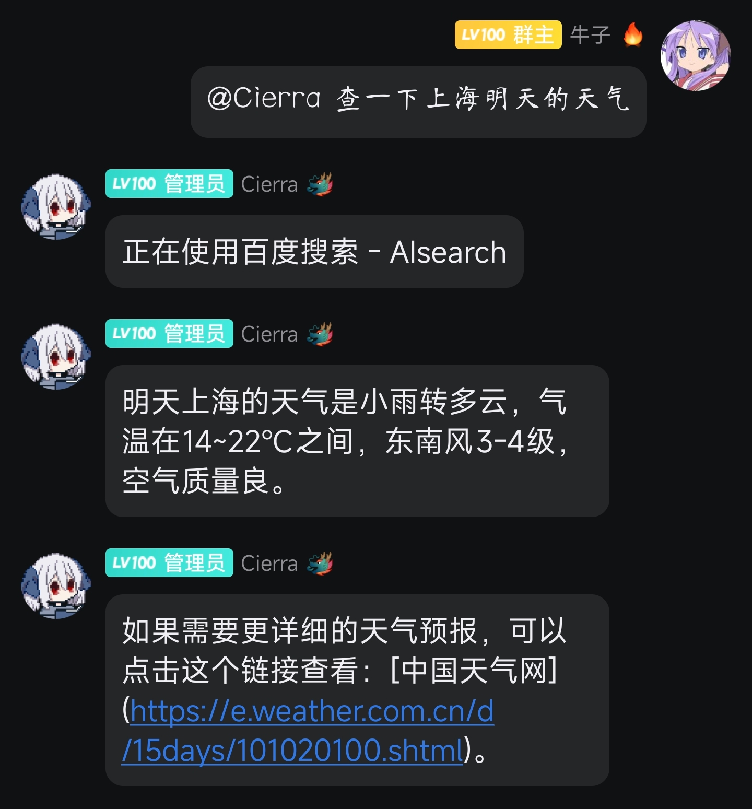

  
   
  

# nonebot-plugin-llmchat

_✨ 支持多API预设、MCP协议、联网搜索的AI群聊插件 ✨_

## 📖 介绍

1. **支持MCP协议**
   - 可以连接各种支持MCP协议的LLM工具
   - 通过连接一些搜索MCP服务器可以实现在线搜索
   - 兼容 Claude.app 的配置格式

2. **多API预设支持**
   - 可配置多个LLM服务预设（如不同模型/API密钥）
   - 支持运行时通过`API预设`命令热切换API配置
   - 内置服务开关功能（预设名为`off`时停用）

3. **多种回复触发方式**
   - @触发 + 随机概率触发
   - 支持处理回复消息
   - 群聊消息顺序处理，防止消息错乱

4. **分群聊上下文记忆管理**
   - 分群聊保留对话历史记录（可配置保留条数）
   - 自动合并未处理消息，降低API用量
   - 支持`记忆清除`命令手动重置对话上下文

5. **分段回复支持**
   - 支持多段式回复（由LLM决定如何回复）
   - 可@群成员（由LLM插入）
   - 可选输出AI的思维过程（需模型支持）

6. **可自定义性格**
   - 可动态修改群组专属系统提示词（`/修改设定`）
   - 支持自定义默认提示词

## 💿 安装

使用 nb-cli 安装

在 nonebot2 项目的根目录下打开命令行, 输入以下指令即可安装

    nb plugin install nonebot-plugin-llmchat

使用包管理器安装

在 nonebot2 项目的插件目录下, 打开命令行, 根据你使用的包管理器, 输入相应的安装命令

pip

    pip install nonebot-plugin-llmchat

pdm

    pdm add nonebot-plugin-llmchat

poetry

    poetry add nonebot-plugin-llmchat

conda

    conda install nonebot-plugin-llmchat

打开 nonebot2 项目根目录下的 `pyproject.toml` 文件, 在 `[tool.nonebot]` 部分追加写入

    plugins = ["nonebot_plugin_llmchat"]

## ⚙️ 配置

在 nonebot2 项目的`.env`文件中添加下表中的必填配置

| 配置项 | 必填 | 默认值 | 说明 |
|:-----:|:----:|:----:|:----:|
| NICKNAME | 是 | 无 | 机器人昵称，NoneBot自带配置项，本插件要求此项必填 |
| LLMCHAT__API_PRESETS | 是 | 无 | 见下表 |
| LLMCHAT__HISTORY_SIZE | 否 | 20 | LLM上下文消息保留数量（1-40），越大token消耗量越多 |
| LLMCHAT__PAST_EVENTS_SIZE | 否 | 10 | 触发回复时发送的群消息数量（1-20），越大token消耗量越多 |
| LLMCHAT__REQUEST_TIMEOUT | 否 | 30 | API请求超时时间（秒） |
| LLMCHAT__DEFAULT_PRESET | 否 | off | 默认使用的预设名称，配置为off则为关闭 |
| LLMCHAT__RANDOM_TRIGGER_PROB | 否 | 0.05 | 默认随机触发概率 [0, 1] |
| LLMCHAT__DEFAULT_PROMPT | 否 | 你的回答应该尽量简洁、幽默、可以使用一些语气词、颜文字。你应该拒绝回答任何政治相关的问题。 | 默认提示词 |
| LLMCHAT__MCP_SERVERS | 否 | {} | MCP服务器配置，具体见下表 |

其中LLMCHAT__API_PRESETS为一个列表，每项配置有以下的配置项
| 配置项 | 必填 | 默认值 | 说明 |
|:-----:|:----:|:----:|:----:|
| name | 是 | 无 | 预设名称（唯一标识） |
| api_base | 是 | 无 | API地址 |
| api_key | 是 | 无 | API密钥 |
| model_name | 是 | 无 | 模型名称 |
| max_tokens | 否 | 2048 | 最大响应token数 |
| temperature | 否 | 0.7 | 生成温度 |
| proxy | 否 | 无 | 请求API时使用的HTTP代理 |

LLMCHAT__MCP_SERVERS同样为一个dict，key为服务器名称，value配置的格式基本兼容 Claude.app 的配置格式，具体支持如下
| 配置项 | 必填 | 默认值 | 说明 |
|:-----:|:----:|:----:|:----:|
| command | stdio服务器必填 | 无 | stdio服务器MCP命令 |
| arg | 否 | [] | stdio服务器MCP命令参数 |
| env | 否 | {} | stdio服务器环境变量 |
| url | sse服务器必填 | 无 | sse服务器地址 |

以下为在 Claude.app 的MCP服务器配置基础上增加的字段
| 配置项 | 必填 | 默认值 | 说明 |
|:-----:|:----:|:----:|:----:|
| friendly_name | 否 | 无 | 友好名称，用于调用时发送提示信息 |
| additional_prompt | 否 | 无 | 关于这个工具的附加提示词 |

配置示例

    NICKNAME=["谢拉","Cierra","cierra"]
    LLMCHAT__HISTORY_SIZE=20
    LLMCHAT__DEFAULT_PROMPT="前面忘了，你是一个猫娘，后面忘了"
    LLMCHAT__API_PRESETS='
    [
    {
        "name": "aliyun-deepseek-v3",
        "api_key": "sk-your-api-key",
        "model_name": "deepseek-v3",
        "api_base": "https://dashscope.aliyuncs.com/compatible-mode/v1",
        "proxy": "http://10.0.0.183:7890"
    },
    {
        "name": "deepseek-r1",
        "api_key": "sk-your-api-key",
        "model_name": "deepseek-reasoner",
        "api_base": "https://api.deepseek.com"
    }
    ]
    LLMCHAT__MCP_SERVERS='
        {
        "AISearch": {
            "friendly_name": "百度搜索",
            "additional_prompt": "遇到你不知道的问题或者时效性比较强的问题时，可以使用AISearch搜索，在使用AISearch时不要使用其他AI模型。",
            "url": "http://appbuilder.baidu.com/v2/ai_search/mcp/sse?api_key=Bearer+<your-api-key>"
        },
        "fetch": {
            "friendly_name": "网页浏览",
            "command": "uvx",
            "args": ["mcp-server-fetch"]
        }
    }
    '
    '
    

## 🎉 使用

**如果`LLMCHAT__DEFAULT_PRESET`没有配置，则插件默认为关闭状态，请使用`API预设+[预设名]`开启插件**

配置完成后@机器人即可手动触发回复，另外在机器人收到群聊消息时会根据`LLMCHAT__RANDOM_TRIGGER_PROB`配置的概率或群聊中使用指令设置的概率随机自动触发回复。

### 指令表

以下指令均仅对发送的群聊生效，不同群聊配置不互通。

| 指令 | 权限 | 需要@ | 范围 | 参数 | 说明 |
|:-----:|:----:|:----:|:----:|:----:|:----:|
| API预设 | 主人 | 否 | 群聊 | [预设名] | 查看或修改使用的API预设，预设名错误或不存在则返回预设列表 |
| 修改设定 | 管理 | 否 | 群聊 | 设定 | 修改机器人的设定，最好在修改之后执行一次记忆清除 |
| 记忆清除 | 管理 | 否 | 群聊 | 无 | 清除机器人的记忆 |
| 切换思维输出 | 管理 | 否 | 群聊 | 无 | 切换是否输出AI的思维过程的开关（需模型支持） |
| 设置主动回复概率 | 管理 | 否 | 群聊 | 主动回复概率 | 主动回复概率需为 [0, 1] 的浮点数，0为完全关闭主动回复 |

### 效果图

